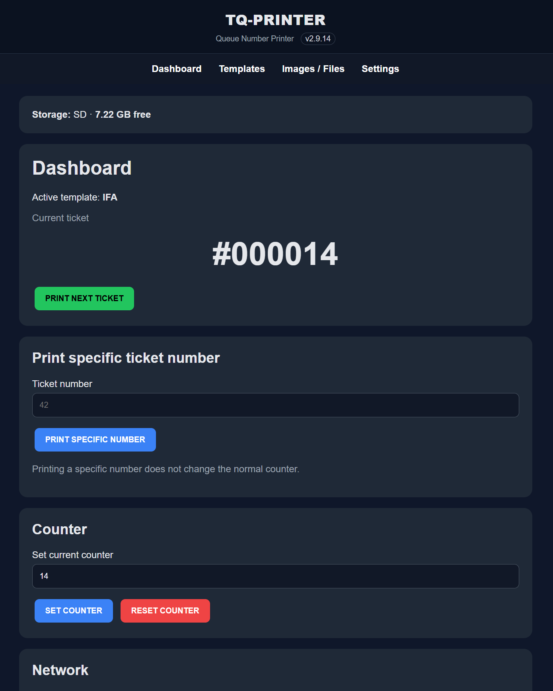
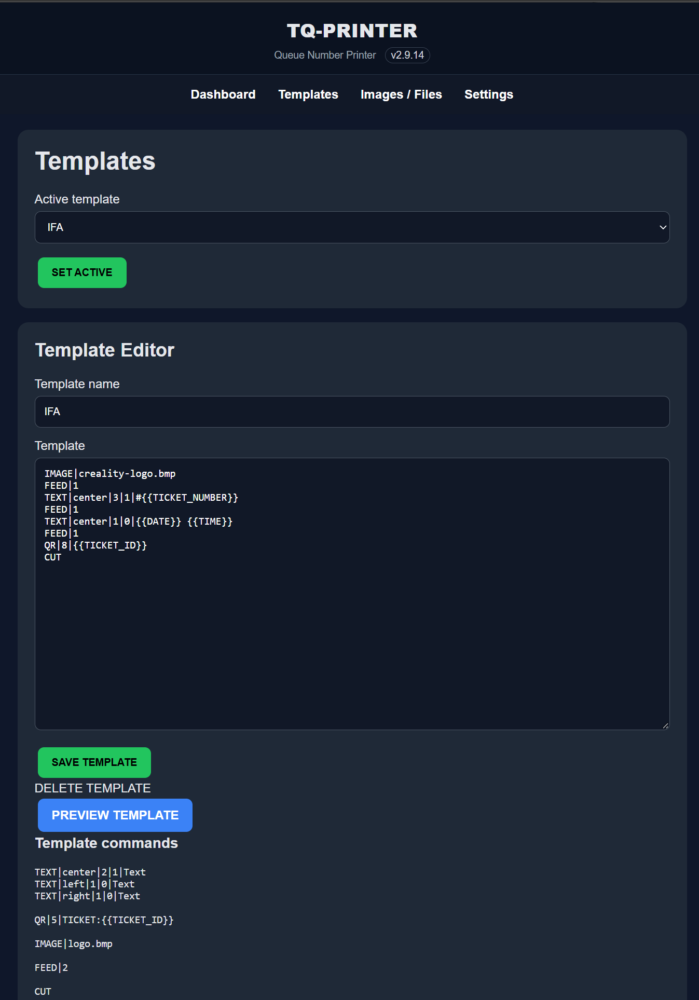
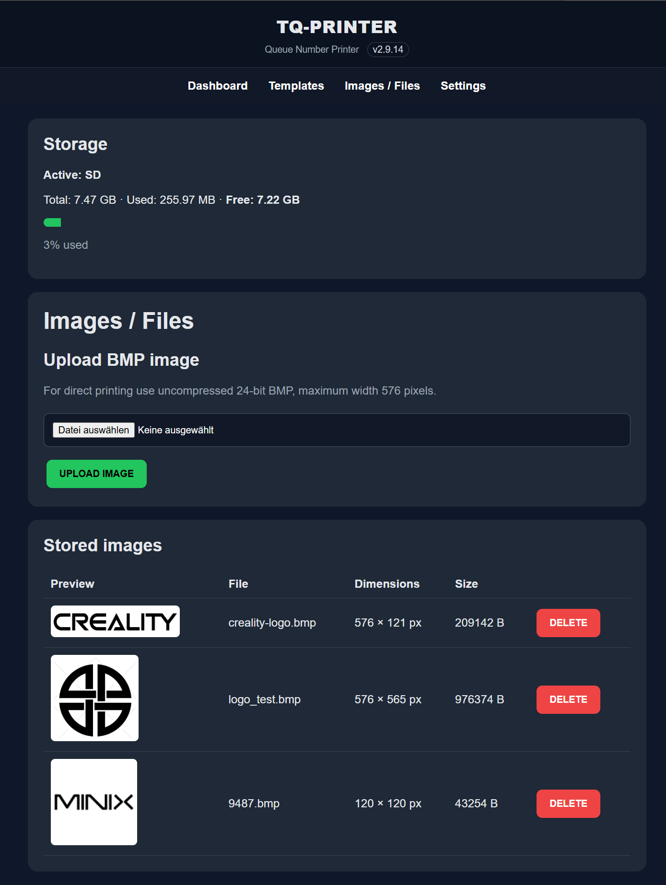
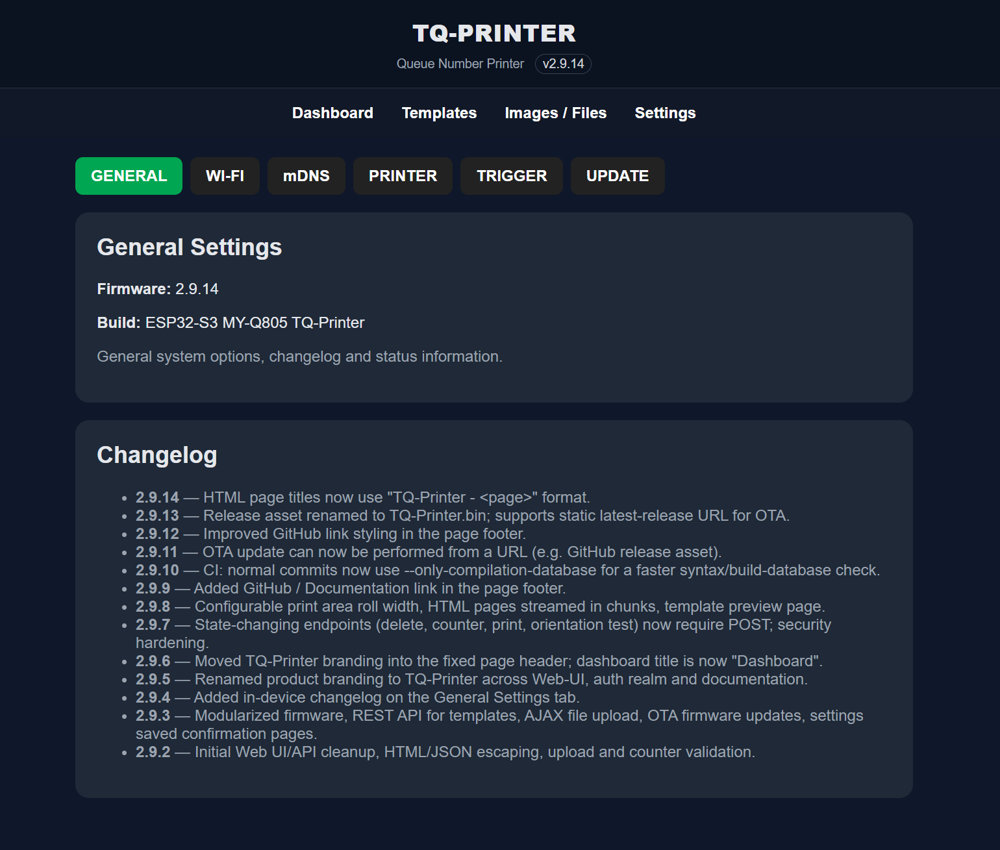
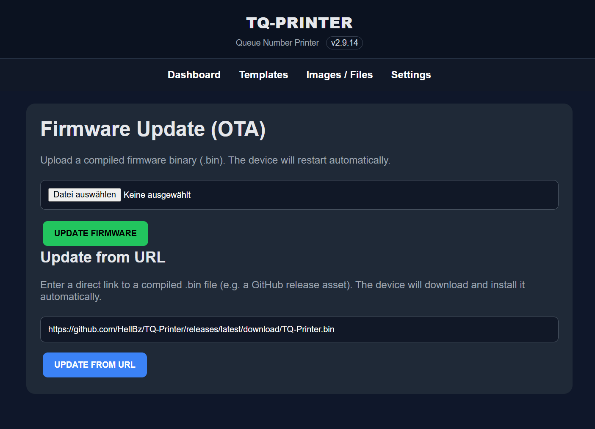

# TQ-Printer

ESP32-S3 based queue number / thermal printer firmware for the MY-Q805K.

<p align="center">
  
</p>

TQ-Printer provides a web-based dashboard to configure Wi-Fi, edit ticket templates, upload images, control the counter and update the firmware over the air.

## Features

- Web UI for configuration, templates, images and printing
- REST API for templates, printing and counter control
- AJAX file upload with progress bar
- OTA firmware updates over the web UI
- Wi-Fi client mode with fallback access point
- mDNS (`http://ticketprinter.local` or `http://tickets.local` depending on hostname)
- GPIO trigger button support
- Modular code structure

## Screenshots

The remaining pages are shown below in a 2×2 grid.

<table>
  <tr>
    <td align="center"><b>Template editor</b><br></td>
    <td align="center"><b>Image / file manager</b><br></td>
  </tr>
  <tr>
    <td align="center"><b>Settings</b><br></td>
    <td align="center"><b>OTA firmware update</b><br></td>
  </tr>
</table>

## Hardware

- **Controller:** ESP32-S3 (N16R8 recommended: 16 MB Flash, 8 MB PSRAM)
- **Printer:** MY-Q805K or compatible ESC/POS thermal printer
- **UART:** GPIO17 (TX), GPIO18 (RX), 1.500.000 baud
- **Trigger button:** GPIO14 (active low, internal pull-up)
- **SD card (built-in):** GPIO38 CMD, GPIO39 CLK, GPIO40 DATA (1-bit SD_MMC)

For a full pinout see the project documentation.

## Project structure

```
Thermo-Printer/
├── Thermal-Printer/              # Main Arduino sketch and headers
│   ├── Thermal-Printer.ino      # Sketch entry point
│   ├── config.h                 # Pins, defaults, firmware version
│   ├── globals.h                # Global objects and runtime variables
│   ├── storage.h                # SD / LittleFS storage helpers
│   ├── helpers.h                # String, escape and path helpers
│   ├── auth.h                   # Admin password / Basic Auth
│   ├── printer.h                # ESC/POS, QR, BMP, template engine
│   ├── settings_network.h       # Preferences, Wi-Fi and trigger setup
│   ├── webui.h                  # Web UI, HTTP handlers and routes
│   └── API.md                   # REST API documentation
├── flash.py                     # Local build & flash helper (Python)
├── screenshots/                 # UI screenshots for the README
├── README.md                    # This file
└── .github/workflows/            # GitHub Actions CI/CD
```

## Quick start

### Local build & flash

1. Install [arduino-cli](https://arduino.github.io/arduino-cli/latest/installation/) and make sure it is in your `PATH`.
2. Connect the ESP32-S3 to USB.
3. Run from this folder:

```bash
python flash.py --port COM8
```

Or on Windows simply double-click `flash.bat` and pass the port.

### Manual Arduino CLI

```bash
arduino-cli compile --fqbn esp32:esp32:esp32s3 --output-dir build Thermal-Printer
arduino-cli upload --fqbn esp32:esp32:esp32s3 --port COM8 --input-dir build Thermal-Printer
```

Replace `COM8` with your ESP32-S3 port.

## Web UI

After flashing the device starts a fallback access point (`TicketPrinter` / `12345678`) unless it can connect to a configured Wi-Fi network.

Open:

```text
http://ticketprinter.local
```

or the IP shown in the serial monitor.

## REST API

See [`Thermal-Printer/API.md`](Thermal-Printer/API.md) for the full API documentation.

## Releases / CI-CD

This repository includes a GitHub Actions workflow that:

1. Compiles the firmware on every push to `main`/`master`.
2. Creates a GitHub Release and attaches `TQ-Printer.bin` when you push a tag starting with `v`.

### Create a release

```bash
git tag v2.9.7
git push origin v2.9.7
```

GitHub Actions will automatically build the firmware and publish a release with the compiled `.bin` attached.

## License

See [`LICENSE.txt`](LICENSE.txt).
